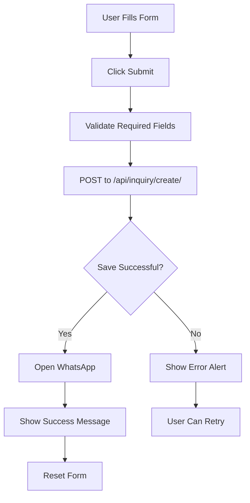

# Complete Inquiry System Summary - chobighar

## 🎯 Overview

chobighar website has **THREE inquiry forms** that all:
1. ✅ **Save data to the database** (Inquiry model in Django)
2. ✅ **Open WhatsApp** with pre-filled messages
3. ✅ **Use the same WhatsApp number** from ContactInfo admin

---

## 📋 All Three Inquiry Forms

| # | Form Name | Location | Purpose | Inquiry Type | Source |
|---|-----------|----------|---------|--------------|--------|
| 1️⃣ | **Photography Inquiry** | Homepage | Quick photography service requests | `photoshoot` | `contact_form` |
| 2️⃣ | **General Contact** | `/contact` page | Detailed contact & general inquiries | `general` | `contact_page` |
| 3️⃣ | **Vendor Inquiry** | `/[vendorId]` | Vendor-specific inquiries | `vendor` | `vendor_detail_page` |

---

## 1️⃣ Photography Inquiry Form (Homepage)

### Location:
- **Page**: Homepage
- **Section**: "LET'S PLAN YOUR MARRIAGE PHOTOGRAPHY IN KOLKATA NOW!"
- **Component**: `components/ContactForm.tsx`

### Fields:
- Type of Shoot (dropdown - required)
- Preferred Date (date - required)
- Email Address (email - required)
- Phone Number (tel - required)
- Your Requirements (textarea - optional)

### Database Record:
```json
{
  "inquiry_type": "photoshoot",
  "name": "Photography Client",  // Placeholder
  "email": "customer@email.com",
  "phone": "+91 9876543210",
  "subject": "Wedding Photography - Photography Inquiry",
  "message": "We need wedding photography...\n\nEvent Date: 2025-12-25\nType: Wedding Photography",
  "service_name": "Wedding Photography",
  "event_date": "2025-12-25",
  "source": "contact_form"
}
```

### WhatsApp Message:
```
📞 Contact Form Submission 📞

👤 Name: Photography Client
📧 Email: customer@email.com
📱 Phone: +91 9876543210
🎯 Subject: Wedding Photography
💬 Message:
We need wedding photography for our event.

✨ Sent via chobighar.com Contact Form ✨
```

---

## 2️⃣ General Contact Form (Contact Page)

### Location:
- **Page**: `/contact`
- **Section**: "Start Your Journey" form
- **Component**: `src/app/contact/page.tsx`

### Fields:
- Your Name (text - required)
- Phone Number (tel - required)
- Email Address (email - required)
- Service Interested In (dropdown - optional)
- Event Date (date - optional)
- Tell Us About Your Vision (textarea - optional)

### Database Record:
```json
{
  "inquiry_type": "general",
  "name": "John Doe",
  "email": "john@email.com",
  "phone": "+91 9876543210",
  "subject": "Contact Form - Wedding Photography",
  "message": "I am interested in pre-wedding photography services.",
  "service_name": "Wedding Photography",
  "event_date": "2025-12-25",
  "source": "contact_page"
}
```

### WhatsApp Message:
```
📞 Contact Form Submission 📞

👤 Name: John Doe
📧 Email: john@email.com
📱 Phone: +91 9876543210
🎯 Subject: Wedding Photography
💬 Message:
I am interested in pre-wedding photography services.

✨ Sent via chobighar.com Contact Form ✨
```

---

## 3️⃣ Vendor Inquiry Form (Vendor Profile)

### Location:
- **Page**: `/[vendorId]` (e.g., `/raj-photography`)
- **Section**: "Get In Touch" contact section
- **Component**: `src/app/[vendorId]/page.tsx`

### Fields:
- Your Name (text - required)
- Phone Number (tel - required)
- Email Address (email - required)
- Event Date (date - optional)
- Tell us about your event requirements (textarea - optional)

### Database Record:
```json
{
  "inquiry_type": "vendor",
  "name": "John Doe",
  "email": "john@email.com",
  "phone": "+91 9876543210",
  "subject": "Vendor Inquiry - Raj Photography",
  "message": "I am interested in your Wedding Photography services for my event.",
  "service_name": "Raj Photography",
  "service_id": "123",
  "event_date": "2025-12-25",
  "source": "vendor_detail_page"
}
```

### WhatsApp Message:
```
🏪 Vendor Profile Inquiry 🏪

👤 Client Name: John Doe
📧 Email: john@email.com
📱 Phone: +91 9876543210
🏪 Vendor: Raj Photography
🎯 Service: Wedding Photography
📅 Event Date: December 25, 2025
💰 Budget: To be discussed
📍 Location: To be discussed
💬 Requirements: I am interested in your Wedding Photography services for my event.

✨ Inquiry for vendor via chobighar.com ✨
```

---

## 🔧 How All Forms Work

### Common Flow for All Forms:



### Step-by-Step:

1. **User fills form** with their details
2. **Clicks submit button** (triggers form submission)
3. **Frontend validates** required fields
4. **API call** to Django backend: `POST /api/inquiry/create/`
5. **Django saves** to Inquiry model in database
6. **Response OK** (201 Created)
7. **WhatsApp integration** fetches number from `/api/header/contact-info/`
8. **Formats message** based on form type (photoshoot/general/vendor)
9. **Opens WhatsApp** in new tab with `wa.me/[number]?text=[message]`
10. **Success alert** shown to user
11. **Form resets** to empty state

---

## 📱 WhatsApp Integration

### Single WhatsApp Number Source:

**All three forms use the SAME WhatsApp number from:**
- **Model**: `ContactInfo` (in `backend/header/models.py`)
- **Field**: `whatsapp_number`
- **API**: `/api/header/contact-info/`
- **Admin**: `/admin/header/contactinfo/`

### How to Set WhatsApp Number:

1. Login to Django Admin: `https://yourdomain.com/admin/`
2. Navigate to: **Header** → **Contact Information**
3. Click on the existing contact info record
4. Fill in **"Whatsapp number"** field
   - Format: `+919876543210` or `9876543210`
   - System automatically cleans and formats
5. Ensure **"Is active"** is checked ✅
6. Click **Save**

✅ Now all three forms will use this WhatsApp number!

---

## 💾 Database - Inquiry Model

### All Forms Save To Same Table:

**Model**: `Inquiry` (in `backend/inquiry/models.py`)  
**Admin**: `/admin/inquiry/inquiry/`

### Key Fields:

| Field | Description | Example |
|-------|-------------|---------|
| `inquiry_type` | Type of inquiry | `photoshoot`, `general`, `vendor` |
| `name` | Customer name | "John Doe" |
| `email` | Customer email | "john@email.com" |
| `phone` | Customer phone | "+91 9876543210" |
| `subject` | Inquiry subject | "Vendor Inquiry - Raj Photography" |
| `message` | Detailed message | "I am interested in..." |
| `service_name` | Service/vendor name | "Wedding Photography" |
| `service_id` | Vendor ID (only for vendor inquiries) | "123" |
| `event_date` | Event date | "2025-12-25" |
| `source` | Form source | `contact_form`, `contact_page`, `vendor_detail_page` |
| `status` | Inquiry status | `new`, `contacted`, `in_progress`, `completed` |
| `priority` | Priority level | `low`, `medium`, `high`, `urgent` |

### How to Identify Each Form's Data:

**Homepage Photography Form**:
- `inquiry_type` = `photoshoot`
- `source` = `contact_form`
- `name` = "Photography Client" (placeholder)

**Contact Page Form**:
- `inquiry_type` = `general`
- `source` = `contact_page`
- Has actual customer name

**Vendor Profile Form**:
- `inquiry_type` = `vendor`
- `source` = `vendor_detail_page`
- Has `service_id` field populated

---

## 🎨 Admin Panel Features

### View All Inquiries:

**Navigate to**: `/admin/inquiry/inquiry/`

### List View Shows:

```
Customer Info | Type | Subject | Status | Priority | Service | Event Info | Source | Created
──────────────────────────────────────────────────────────────────────────────────────────────
John Doe      | 🛍️ Vendor | Vendor Inquiry... | 🆕 New | 🟡 Medium | Raj... | 📅 Dec 25 | vendor_detail_page | Oct 8
📞 +91 9876... |          |                   |        |          |        |           |                    |
✉️ john@...   |          |                   |        |          |        |           |                    |
──────────────────────────────────────────────────────────────────────────────────────────────
Photography   | 📸 Photoshoot | Wedding Photo... | 🆕 New | 🟡 Medium | Wedding... | 📅 Dec 20 | contact_form | Oct 8
Client        |               |                  |        |            |            |           |              |
📞 +91 9876... |              |                  |        |            |            |           |              |
✉️ test@...    |              |                  |        |            |            |           |              |
```

### Filters Available:

- **Inquiry Type**: All, Photoshoot, General, Vendor
- **Status**: All, New, Contacted, In Progress, Completed, Cancelled
- **Priority**: All, Low, Medium, High, Urgent
- **Source**: All, contact_form, contact_page, vendor_detail_page
- **Date Range**: Created at, Event date

### Bulk Actions:

- Mark selected inquiries as contacted
- Mark selected inquiries as in progress
- Mark selected inquiries as completed

### Individual Inquiry Management:

1. Click on any inquiry to view details
2. Update status (New → Contacted → In Progress → Completed)
3. Update priority (Low → Medium → High → Urgent)
4. Assign to staff member
5. Add internal notes
6. Add follow-ups (date, method, notes)
7. View response time

---

## 🧪 Testing All Three Forms

### Test Checklist:

#### 1️⃣ Test Homepage Photography Form:
- [ ] Go to homepage
- [ ] Scroll to "LET'S PLAN YOUR MARRIAGE PHOTOGRAPHY" section
- [ ] Fill: Type (Wedding), Date, Email, Phone, Message
- [ ] Click "SEND MESSAGE"
- [ ] Verify: Success message appears
- [ ] Verify: WhatsApp opens with message
- [ ] Verify: Form resets
- [ ] Check admin: Inquiry with `inquiry_type=photoshoot`, `source=contact_form`

#### 2️⃣ Test Contact Page Form:
- [ ] Go to `/contact` page
- [ ] Scroll to "Start Your Journey" form
- [ ] Fill: Name, Phone, Email, Service, Event Date, Message
- [ ] Click "Send Message & Get Quote"
- [ ] Verify: Success message appears
- [ ] Verify: WhatsApp opens with message
- [ ] Verify: Form resets
- [ ] Check admin: Inquiry with `inquiry_type=general`, `source=contact_page`

#### 3️⃣ Test Vendor Profile Form:
- [ ] Go to any vendor profile (e.g., `/raj-photography`)
- [ ] Scroll to "Get In Touch" section
- [ ] Fill: Name, Phone, Email, Event Date, Message
- [ ] Click "Send Message"
- [ ] Verify: Success alert appears
- [ ] Verify: WhatsApp opens with vendor-specific message
- [ ] Verify: Form resets
- [ ] Check admin: Inquiry with `inquiry_type=vendor`, `source=vendor_detail_page`

### Verify in Admin Panel:

1. Login to `/admin/`
2. Go to **Inquiry** → **Inquiries**
3. Should see 3 new inquiries (one from each form)
4. Each should have:
   - ✅ Correct inquiry type
   - ✅ Correct source
   - ✅ All form data populated
   - ✅ Status: "New"
   - ✅ Priority: "Medium"
   - ✅ Created timestamp

---

## 📊 Analytics & Tracking

### Track Performance by Source:

**Query 1: Total inquiries by source**
```python
from inquiry.models import Inquiry

contact_form = Inquiry.objects.filter(source='contact_form').count()
contact_page = Inquiry.objects.filter(source='contact_page').count()
vendor_page = Inquiry.objects.filter(source='vendor_detail_page').count()

print(f"Homepage Form: {contact_form}")
print(f"Contact Page: {contact_page}")
print(f"Vendor Pages: {vendor_page}")
```

**Query 2: Conversion rate by source**
```python
from inquiry.models import Inquiry

for source in ['contact_form', 'contact_page', 'vendor_detail_page']:
    total = Inquiry.objects.filter(source=source).count()
    completed = Inquiry.objects.filter(source=source, status='completed').count()
    rate = (completed / total * 100) if total > 0 else 0
    print(f"{source}: {rate:.1f}% conversion ({completed}/{total})")
```

**Query 3: Most popular services**
```python
from inquiry.models import Inquiry
from django.db.models import Count

services = Inquiry.objects.values('service_name').annotate(count=Count('id')).order_by('-count')[:5]
for service in services:
    print(f"{service['service_name']}: {service['count']} inquiries")
```

---

## 🔐 Security & Validation

### Frontend Validation:
- ✅ Required fields marked and validated
- ✅ Email format validation
- ✅ Phone number format validation
- ✅ Date validation (future dates only)
- ✅ Form sanitization before submission

### Backend Validation:
- ✅ Django model validators
- ✅ Phone number regex validation
- ✅ Email format validation
- ✅ CSRF token protection
- ✅ Rate limiting (optional - can be added)

### Data Privacy:
- ✅ Customer data stored securely in database
- ✅ Only admins can view inquiries
- ✅ WhatsApp messages not stored (only sent)
- ✅ Email/phone not exposed in frontend code

---

## 🚀 Production Deployment

### Environment Variables:

```env
# Frontend (.env.local)
NEXT_PUBLIC_API_URL=https://api.chobighar.com

# Backend (settings.py or .env)
ALLOWED_HOSTS=chobighar.com,www.chobighar.com
CORS_ALLOWED_ORIGINS=https://chobighar.com,https://www.chobighar.com
```

### Pre-deployment Checklist:

- [ ] Set production API URL
- [ ] Set production WhatsApp number in admin
- [ ] Test all three forms on production
- [ ] Verify WhatsApp opens correctly
- [ ] Verify admin panel is accessible
- [ ] Set up email notifications for new inquiries (optional)
- [ ] Monitor inquiry submissions
- [ ] Train staff on admin panel usage

---

## 📱 Mobile Experience

### All Forms Are Mobile-Responsive:

**Homepage Form**:
- Stacks to single column on mobile
- Touch-friendly input fields
- Large submit button
- Optimized for small screens

**Contact Page**:
- Grid layout adapts to mobile
- Sidebar moves below form on mobile
- Card-based design for better touch targets

**Vendor Profile Form**:
- Two-column grid becomes single column
- Contact info cards stack vertically
- Form inputs expand to full width

---

## 🎯 Best Practices

### For Users:
1. Fill all required fields (marked with *)
2. Provide accurate phone number for WhatsApp
3. Be specific in message field
4. Double-check email address
5. Select appropriate event date

### For Admins:
1. **Respond quickly** - aim for <2 hours
2. **Update status** after contacting customer
3. **Add notes** for context
4. **Assign inquiries** to team members
5. **Track event dates** and follow up
6. **Mark completed** when booking confirmed

### For Developers:
1. **Monitor API errors** in backend logs
2. **Check WhatsApp integration** regularly
3. **Test forms after deployments**
4. **Keep admin panel organized** with filters
5. **Add more fields** as needed per business requirements

---

## 🔄 Future Enhancements

### Potential Improvements:

**Email Notifications**:
- Send email to admin when new inquiry arrives
- Send confirmation email to customer
- Automated follow-up emails

**SMS Integration**:
- Send SMS confirmation to customer
- SMS alerts for high-priority inquiries

**CRM Integration**:
- Sync inquiries with CRM system
- Automated lead scoring
- Pipeline tracking

**Analytics Dashboard**:
- Inquiry trends over time
- Conversion rate by source
- Popular services/vendors
- Response time metrics

**Automated Responses**:
- Auto-reply on WhatsApp
- Chatbot for initial inquiry
- FAQ integration

---

## ✅ Summary

### System Overview:

**Three Forms** → **One Database** → **One WhatsApp Number** → **One Admin Panel**

### Quick Reference:

| Form | Inquiry Type | Source | Has Name Field | Has Vendor ID |
|------|--------------|--------|----------------|---------------|
| Homepage | photoshoot | contact_form | ❌ (placeholder) | ❌ |
| Contact Page | general | contact_page | ✅ | ❌ |
| Vendor Profile | vendor | vendor_detail_page | ✅ | ✅ |

### Configuration:

**WhatsApp Number**: `/admin/header/contactinfo/` → `whatsapp_number` field  
**View Inquiries**: `/admin/inquiry/inquiry/`  
**API Endpoint**: `/api/inquiry/create/` (POST)  
**Contact Info API**: `/api/header/contact-info/` (GET)

### Success Criteria:

✅ All forms submit successfully  
✅ Data appears in admin panel  
✅ WhatsApp opens with correct message  
✅ Forms reset after submission  
✅ Error handling works properly  
✅ Mobile responsive design  

**Your complete inquiry system is ready to capture and manage all customer inquiries!** 🎉
